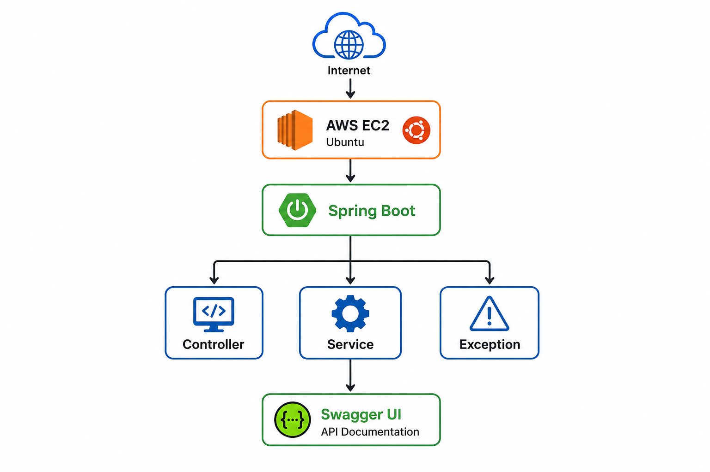

# 🚀 Portfolio API

> A production-ready Spring Boot REST API demonstrating modern Java backend development practices, clean architecture, RESTful design, and cloud deployment on AWS EC2.


---

# 📖 Overview

Portfolio API is a lightweight Spring Boot REST application created to demonstrate backend engineering skills using industry-standard development practices.

The project showcases how to design RESTful APIs, organize business logic using a layered architecture, document APIs with Swagger/OpenAPI, and deploy a Java application on an AWS EC2 instance.

It serves as a foundation for larger enterprise backend systems.

---

## 📌 Project Information

| Property | Value |
|----------|-------|
| Language | Java 17 |
| Framework | Spring Boot 3.5 |
| Build Tool | Maven |
| Architecture | Layered Architecture |
| API Style | REST |
| Documentation | Swagger/OpenAPI |
| Deployment | AWS EC2 |
| Status | Active Development |


---

# ✨ Features

- RESTful API Development
- GET APIs
- POST APIs
- PUT APIs
- DELETE APIs
- RequestBody
- PathVariable
- RequestParam
- Service Layer Architecture
- Global Exception Handling
- Swagger/OpenAPI Documentation
- Maven Build & Packaging
- AWS EC2 Deployment
- Clean Project Structure
- Production-ready Configuration

---

# 🛠 Technologies Used

| Category | Technology |
|----------|------------|
| Language | Java 17 |
| Framework | Spring Boot 3.5 |
| Build Tool | Maven |
| Documentation | Swagger / OpenAPI |
| Cloud | AWS EC2 (Ubuntu) |
| Version Control | Git |
| Repository | GitHub |

---

# 🏗 Architecture

The project follows a layered architecture to ensure maintainability, scalability, and separation of responsibilities.

<p align="center">
    
</p>

### Architecture Flow

1. 🌐 Client sends an HTTP request over the Internet.
2. ☁️ AWS EC2 (Ubuntu) hosts the Spring Boot application.
3. 🚀 Spring Boot receives and processes the request.
4. 🎮 The Controller layer handles incoming API requests.
5. ⚙️ The Service layer contains the business logic.
6. ⚠️ The Global Exception Handler manages application errors consistently.
7. 📚 Swagger UI provides interactive API documentation for testing and exploration.


# 📌 Key Highlights

✔ Built using Java 21 and Spring Boot 3.5

✔ Follows Layered Architecture and Separation of Concerns

✔ RESTful API Design using Spring Boot

✔ Interactive API Documentation with Swagger/OpenAPI

✔ Centralized Exception Handling

✔ Deployed on AWS EC2 (Ubuntu)

✔ Maven-based Build Automation

✔ Clean and Maintainable Project Structure

✔ Production-Oriented Development Workflow

✔ Designed as a Foundation for Enterprise Backend Applications


### Controller

Handles HTTP requests and responses.

### Service

Contains business logic.

### Exception Handler

Provides centralized exception management.

This architecture follows Spring Boot best practices and keeps responsibilities well separated.

---

# 📂 Project Structure

```
portfolio-api
│
├── src
│   ├── main
│   │   ├── java
│   │   │   ├── controller
│   │   │   ├── service
│   │   │   ├── exception
│   │   │   └── PortfolioApiApplication.java
│   │   │
│   │   └── resources
│   │       └── application.properties
│   │
│   └── test
│
├── pom.xml
├── README.md
└── target
```

---

# 🚀 Run Locally

### Clone Repository

```bash
git clone https://github.com/yourusername/portfolio-api.git
```

---

### Navigate to Project

```bash
cd portfolio-api
```

---

### Build

```bash
mvn clean package
```

---

### Run

```bash
java -jar target/portfolio-api-0.0.1-SNAPSHOT.jar
```

The application will start on:

```
http://localhost:8080
```

---

# ☁ AWS Deployment

This application is deployed on an AWS EC2 Ubuntu instance.

### Live API

```
http://15.134.216.16:8080/hello
```

---

### Swagger Documentation

```
http://15.134.216.16:8080/swagger-ui/index.html
```

---

# 📚 API Documentation

| Method | Endpoint | Description |
|---------|----------|-------------|
| GET | /hello | Returns welcome message |

Future endpoints will include:

- User APIs
- Authentication APIs
- CRUD APIs
- Validation APIs

---

# 🧪 Example Response

```
GET /hello

Response

Hello from Spring Boot deployed on AWS!
```

---

---

# 🔮 Future Improvements

The project is continuously evolving.

Planned enhancements include:

- Spring Security
- JWT Authentication
- Hibernate & JPA
- MySQL Database Integration
- Docker Support
- GitHub Actions CI/CD
- Unit Testing with JUnit
- Mockito Testing
- Logging with SLF4J
- Health Checks using Spring Boot Actuator
- Docker Compose
- Nginx Reverse Proxy
- HTTPS Support
- AWS RDS Integration
- Microservices Migration
- Kubernetes Deploymen
---
.
